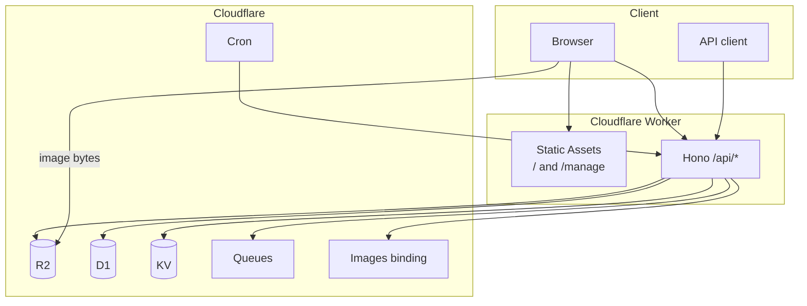

# CattoPic

Self-hosted image host: upload, tags, WebP/AVIF variants, expiry, and a public random-image API.

**1.0.0** runs the admin UI and the API on **one Cloudflare Worker**. Open the Worker hostname (`workers.dev` or a Custom Domain) and the UI is there. There is no Vercel app and no second frontend deploy.

Image **files** live in R2 and are served from `R2_PUBLIC_URL` (object CDN and `/cdn-cgi/image`). That is storage, not a second app.

[中文](./docs/README_CN.md) · [Changelog](./CHANGELOG.md) · [API](./docs/API_EN.md) · [Deploy](./DEPLOYMENT.md)

## What 1.0.0 changes

| Before | After |
|--------|--------|
| Next.js on Vercel + Hono Worker | One Worker: Vite React SPA (Static Assets) + Hono `/api/*` |
| UI called `NEXT_PUBLIC_API_URL` | Same-origin `fetch("/api/...")` |
| Docs described `GET /r2/{path}` | Image bytes from `R2_PUBLIC_URL` only |

Public HTTP routes are unchanged. `GET /api/random` still returns **302** to an image URL.

## Architecture



| Path | Role |
|------|------|
| `https://<worker>/` | Upload UI |
| `https://<worker>/manage` | Gallery / tags |
| `https://<worker>/api/*` | Hono API (this is the only path that invokes the Worker script) |

Static HTML/JS/CSS does not invoke the Worker. `assets.run_worker_first` is `["/api/*"]` only.

### Storage keys

| Variant | Key |
|---------|-----|
| Original | `original/{orientation}/{id}.{ext}` |
| WebP | `{orientation}/webp/{id}.webp` |
| AVIF | `{orientation}/avif/{id}.avif` |

GIF is original-only. JPEG/PNG larger than 20MB skip the Images binding; variant URLs may use `/cdn-cgi/image`. Advertised max upload is 70MB.

## Features

- JPEG, PNG, GIF, WebP, AVIF upload
- Stored WebP/AVIF for files within the Images `.input()` limit (20MB)
- Tags, batch tag edits, expiry
- Public `GET /api/random` with `orientation`, `tags`, `exclude`, `format`
- ZIP upload in the browser (extract, then concurrent `POST /api/upload/single`)
- Dark mode management UI

## Bindings

Configured in `wrangler.jsonc`:

| Binding | Resource |
|---------|----------|
| `R2_BUCKET` | R2 bucket `cattopic` |
| `DB` | D1 `CattoPic-D1` |
| `CACHE_KV` | KV `cattopic-kv` |
| `DELETE_QUEUE` | Queue `cattopic-delete-queue` |
| `IMAGES` | Cloudflare Images |
| `ASSETS` | Static Assets (the UI) |

`USE_QUEUE` is `true`: R2 deletes go through the queue. Forks can set it to `false` for synchronous deletes.

## Commands

Requires Node.js 24+ and [pnpm](https://pnpm.io/).

```bash
git clone https://github.com/Yuri-NagaSaki/CattoPic.git
cd CattoPic
pnpm install
pnpm dev       # http://localhost:5173  (UI + API)
pnpm build
pnpm run deploy    # vite build && wrangler deploy
pnpm typecheck
pnpm test
```

## Deploy

```bash
pnpm wrangler login
pnpm wrangler d1 migrations apply CattoPic-D1 --remote
pnpm wrangler d1 execute CattoPic-D1 --remote --command "
INSERT OR IGNORE INTO api_keys (key, created_at) VALUES ('your-secure-api-key', datetime('now'));
"
pnpm run deploy
```

Then open `https://cattopic-worker.<subdomain>.workers.dev` (or your Custom Domain). Paste the API key in the UI.

```bash
curl -I "https://cattopic-worker.<subdomain>.workers.dev/api/random"
```

Enable public access on the R2 bucket and set `vars.R2_PUBLIC_URL` in `wrangler.jsonc`.

Forks: copy `wrangler.example.jsonc` to `wrangler.jsonc` and fill D1/KV ids.

GitHub Actions uses `CLOUDFLARE_API_TOKEN` and `CLOUDFLARE_ACCOUNT_ID`. Config is the committed `wrangler.jsonc`.

Full steps: [DEPLOYMENT.md](./DEPLOYMENT.md).

## API (short)

Public: `GET /api/random` (302 to an image URL). Query: `orientation`, `tags`, `exclude`, `format`. Follow redirects with `curl -L` if you want the file.

Everything else needs `Authorization: Bearer <api-key>`.

| Method | Path |
|--------|------|
| POST | `/api/upload/single` |
| GET/PUT/DELETE | `/api/images`, `/api/images/:id` |
| GET/POST/PUT/DELETE | `/api/tags`, `/api/tags/:name` |
| POST | `/api/tags/batch` |

Full reference: [docs/API_EN.md](./docs/API_EN.md) / [docs/API.md](./docs/API.md).

## License

[GPL-3.0](./LICENSE)
