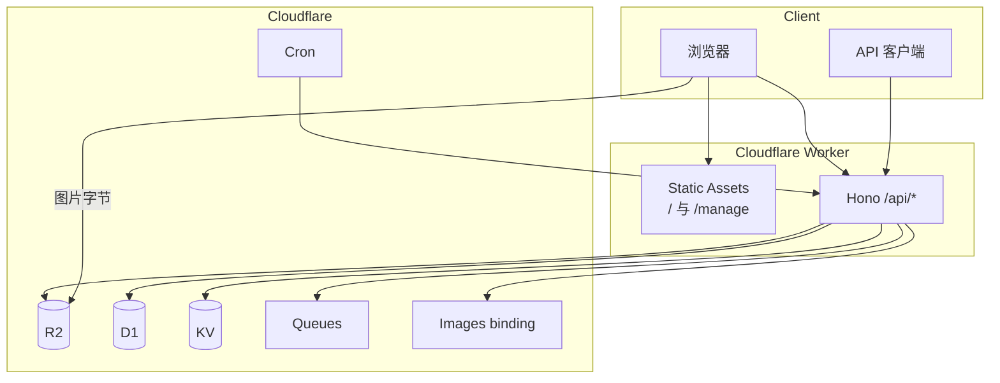

# CattoPic

自托管图床：上传、标签、WebP/AVIF 变体、过期时间、公开随机图 API。

**1.0.0** 把管理界面和 API 放在**同一个 Cloudflare Worker**。打开 Worker 域名（`workers.dev` 或自定义域）就是界面。不再部署 Vercel，也没有第二套前端。

图片**文件**存在 R2，由 `R2_PUBLIC_URL` 提供（对象存储 CDN 和 `/cdn-cgi/image`）。那是存储域名，不是第二套应用。

[English](../README.md) · [更新日志](../CHANGELOG_CN.md) · [API](./API.md) · [部署](../DEPLOYMENT.md)

## 1.0.0 相对旧架构

| 之前 | 现在 |
|------|------|
| Vercel 上的 Next.js + 独立 Hono Worker | 一个 Worker：Vite React SPA（Static Assets）+ Hono `/api/*` |
| 界面请求 `NEXT_PUBLIC_API_URL` | 同源 `fetch("/api/...")` |
| 文档写了 `GET /r2/{path}` | 图片字节只从 `R2_PUBLIC_URL` 读取 |

公开 HTTP 路径不变。`GET /api/random` 仍返回 **302** 到图片 URL。

## 架构



| 路径 | 作用 |
|------|------|
| `https://<worker>/` | 上传页 |
| `https://<worker>/manage` | 图库 / 标签 |
| `https://<worker>/api/*` | Hono API（只有这条路径会调用 Worker 脚本） |

静态 HTML/JS/CSS 不调用 Worker。`assets.run_worker_first` 仅为 `["/api/*"]`。

### 存储键

| 变体 | 键 |
|------|-----|
| 原图 | `original/{orientation}/{id}.{ext}` |
| WebP | `{orientation}/webp/{id}.webp` |
| AVIF | `{orientation}/avif/{id}.avif` |

GIF 只存原图。大于 20MB 的 JPEG/PNG 不走 Images binding，变体 URL 可能使用 `/cdn-cgi/image`。对外上传上限仍是 70MB。

## 功能

- 上传 JPEG、PNG、GIF、WebP、AVIF
- 在 Images `.input()` 上限（20MB）内写入 WebP/AVIF
- 标签、批量改标签、过期时间
- 公开 `GET /api/random`，查询参数：`orientation`、`tags`、`exclude`、`format`
- 浏览器内 ZIP 解压后并发 `POST /api/upload/single`
- 管理界面支持深色模式

## 绑定

写在 `wrangler.jsonc`：

| Binding | 资源 |
|---------|------|
| `R2_BUCKET` | R2 桶 `cattopic` |
| `DB` | D1 `CattoPic-D1` |
| `CACHE_KV` | KV `cattopic-kv` |
| `DELETE_QUEUE` | Queue `cattopic-delete-queue` |
| `IMAGES` | Cloudflare Images |
| `ASSETS` | Static Assets（界面） |

`USE_QUEUE` 为 `true`：R2 删除走队列。Fork 可改为 `false`，改为同步删除。

## 命令

需要 Node.js 24+ 和 [pnpm](https://pnpm.io/)。

```bash
git clone https://github.com/Yuri-NagaSaki/CattoPic.git
cd CattoPic
pnpm install
pnpm dev       # http://localhost:5173（界面 + API）
pnpm build
pnpm deploy    # wrangler deploy
pnpm typecheck
pnpm test
```

## 部署

```bash
pnpm wrangler login
pnpm wrangler d1 migrations apply CattoPic-D1 --remote
pnpm wrangler d1 execute CattoPic-D1 --remote --command "
INSERT OR IGNORE INTO api_keys (key, created_at) VALUES ('your-secure-api-key', datetime('now'));
"
pnpm deploy
```

然后打开 `https://cattopic-worker.<subdomain>.workers.dev`（或自定义域）。在界面里填 API Key。

```bash
curl -I "https://cattopic-worker.<subdomain>.workers.dev/api/random"
```

R2 桶需要可公开读，并把 `vars.R2_PUBLIC_URL` 写进 `wrangler.jsonc`。

Fork：把 `wrangler.example.jsonc` 复制为 `wrangler.jsonc`，填入 D1 / KV 的 id。

GitHub Actions 使用 `CLOUDFLARE_API_TOKEN` 和 `CLOUDFLARE_ACCOUNT_ID`。配置以仓库里的 `wrangler.jsonc` 为准。

完整步骤见 [DEPLOYMENT.md](../DEPLOYMENT.md)。

## API 摘要

公开：`GET /api/random`（302 到图片 URL）。查询参数：`orientation`、`tags`、`exclude`、`format`。若要跟随重定向下载文件，使用 `curl -L`。

其余接口需要 `Authorization: Bearer <api-key>`。

| 方法 | 路径 |
|------|------|
| POST | `/api/upload/single` |
| GET/PUT/DELETE | `/api/images`、`/api/images/:id` |
| GET/POST/PUT/DELETE | `/api/tags`、`/api/tags/:name` |
| POST | `/api/tags/batch` |

完整说明：[API.md](./API.md) / [API_EN.md](./API_EN.md)。

## 许可证

[GPL-3.0](../LICENSE)
